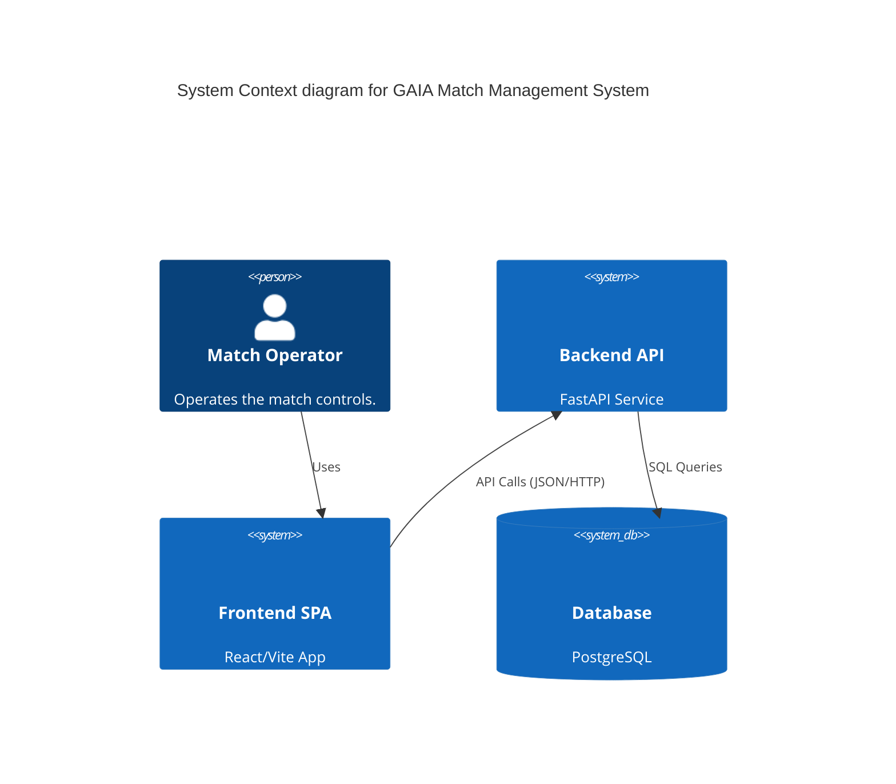

# Architectural Model

## C4 System Context



## Internal Component Diagram (Backend)

```mermaid
graph TD
    subgraph Presentation
        MR[MatchRouter]
    end

    subgraph Application
        MS[MatchService]
    end

    subgraph Domain
        M[Match Entity]
        MR_Port[MatchRepository Port]
    end

    subgraph Infrastructure
        SMR[SQLMatchRepository]
        DB[(PostgreSQL)]
    end

    MR --> MS
    MS --> M
    MS --> MR_Port
    SMR ..|> MR_Port
    SMR --> DB
```
